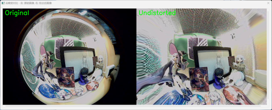

# LineCalibraFisheye
## 项目简介

通过手工标注空间直线，在无标定板的情况下，快速去除鱼眼畸变并标定鱼眼相机！

- **核心功能**：在易用的标注界面上设置直线约束，基于直线约束的鱼眼相机矫正
- **适用场景**：无标定板，图像上有畸变严重的空间直线

## 快速开始

### 创建并进入conda环境（可选）

```bash
conda create -n linecalibrafisheye python=3.8
conda activate linecalibrafisheye
```

### 安装

```bash
git clone https://github.com/zhuangaoooo/LineCalibraFisheye.git
cd LineCalibraFisheye/
pip install -r requirements.txt
```

### 运行

```bash
python3 main.py
```

点击左上角`打开`按钮或键盘快捷键`O`，选择并加载待矫正的鱼眼畸变图像

注意：应避免出现中文路径


在打开的图片上左键单击添加点，可以通过左上角`新建分类`按钮或键盘快捷键`N`新建类别

每一类别中的点应属于同一空间直线，这些点构成了鱼眼矫正的直线约束

可以通过滚轮对图片进行缩放，已经添加的点和直线可在右侧查看


完成标注后点击左上角`去畸变`按钮或键盘快捷键`P`进行基于直线约束的鱼眼相机矫正

将会显示待矫正的鱼眼畸变图像与去畸变图像的对比，标定的内参`K`和畸变系数`D`可在终端查看



## 开发计划

- [ ] 改进优化策（分阶段优化策略，各阶段优化方法等）
- [ ] 支持多张同一镜头的图像联合矫正
- [x] 支持点和直线的删改
- [ ] 实验报告（实验原理，结果比对，性能分析等）
- [ ] 操作运行动图
